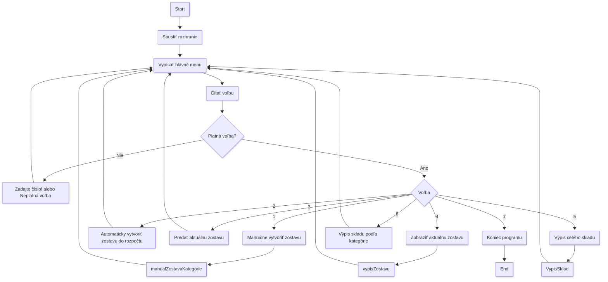

# PC Servis Manager
>## Popis
> **Tento program slúži na správu PC servisu, kde je možné pracovať s komponentmi PC (CPU, RAM, SSD, GPU, MB, ZDROJ, CASE). Program umožňuje modelovanie skladu komponentov, manuálne a automatické vytváranie PC zostáv, predaj zostáv (odstránenie komponentov zo skladu) a analytiku v podobe výpisov zostáv a inventára podľa kategórií.
Program je napísaný v jazyku Java a je spustiteľný v prostredí IntelliJ IDEA. Používa textové menu na ovládanie funkcionalít. Všetky operácie sú realizované cez konzolu.**

>## Inštalácia a spustenie
> **Stiahnite si projekt z GitHub repozitára.
Otvorte projekt v IntelliJ IDEA.
Spustite hlavnú triedu Main.java (obsahuje metódu main).
Program sa spustí v konzole a zobrazí textové menu.**  
>*Žiadne ďalšie závislosti nie sú potrebné (používa štandardné Java knižnice).* 

>## Funkcionality 
> **Manuálne vytvorenie PC zostavy:** *Používateľ vyberá komponenty zo skladu*.
> 
>**Automatické vytvorenie zostavy:** *Generuje zostavu do zadanej maximálnej sumy (náhodný výber komponentov z každej kategórie, kým sa neprekročí budget)*
> 
>**Predaj zostavy:** *Odstráni vybrané komponenty zo skladu.*
> 
>**Výpis zostavy:>**  *Zobrazí detaily zostavy.*
>
>**Výpis inventára:** *Zobrazí komponenty podľa kategórií.*
>
>**Ukončenie programu:** *Možnosť exit.*

> ## Štruktúra projektu
> **Main.java:** Štartuje všetko, pridá testovacie diely.
>
> **model/:** Tu sú "veci" ako:
>
>> **Kategoria.java:** Zoznam typov dielov (CPU, RAM...).
>>
>> **PCKomponent.java:** Jeden diel (názov + cena + typ)
>> 
>> **PCZostava.java:** Tvoja zostava (zoznam dielov).
>>
>> **Sklad.java:** Sklad (zoznam dielov s počtom kusov).
>>
>> **PCServis.java:** Hlavný manažér (pridáva, odoberá, stavá).
>
> **ui/TextoveUI.java:** Menu v texte, kde píšeš čísla.

> ## UML Class Diagram

```mermaid
classDiagram
direction LR
    class Kategoria {
	    CPU
	    RAM
	    SSD
	    GPU
	    MB
	    ZDROJ
	    CASE
    }

    class PCKomponent {
	    -nazov: String
	    -cena: double
	    -kategoria: Kategoria
	    +PCKomponent(nazov: String, cena: double, kategoria: Kategoria)
	    +getNazov() : String
	    +getCena() : double
	    +getKategoria() : Kategoria
	    +toString() : String
	    +equals(o: Object) : boolean
	    +hashCode() : int
    }

    class Sklad {
	    -inventar: Map~PCKomponent, Integer~
	    +pridajKomponent(komponent: PCKomponent, pocet: int) : void
	    +odstranKomponent(komponent: PCKomponent) : boolean
	    +getInventar() : Map~PCKomponent, Integer~
	    +getKomponentyPodlaKategorie(kategoria: Kategoria) : Map~PCKomponent, Integer~
    }

    class PCZostava {
	    -komponenty: List~PCKomponent~
	    +PCZostava()
	    +pridajKomponent(komponent: PCKomponent) : boolean
	    +odstranKomponent(kategoria: Kategoria) : boolean
	    +getKomponenty() : List~PCKomponent~
	    +getCelkovaCena() : double
    }

    class PCServis {
	    -sklad: Sklad
	    -zostava: PCZostava
	    +PCServis(sklad: Sklad)
	    +vytvorZostavuAutomaticky(maxSuma: double) : PCZostava
	    +getZostava() : PCZostava
	    getSklad() : sklad
	    +pridajKomponent(komponent: PCKomponent) : void
	    +predajZostavu(zostava: PCZostava) : void
	    +getKomponentyPodlaKategorie(kategoria: Kategoria) : Map~PCKomponent, Integer~
	    +getInventar() : Map~PCKomponent, Integer~
	    +vypisInventar() : void
    }

    class TextoveUI {
	    -pcServis: PCServis
	    -sc: Scanner
	    -inventar: Map~PCKomponent, Integer~
	    +odstranKomp() :void
	    +TextoveUI(sklad: Sklad)
	    +VypisSklad() : void
	    +manualZostavaKomponenty(kategoria: Kategoria) : boolean
	    +vypisZostavu() : void
	    +odoberKomponent(komponent: PCKomponent) : void
	    +manualZostavaKategorie() : void
	    +pridajKomponent(zostava: PCKomponent) : void
	    +spustitRozhranie() : void
    }

    class Main {
	    +spustit() : void
	    +main(args: String[]) : void
    }

	<<enumeration>> Kategoria

    PCKomponent --> Kategoria : uses
    Sklad "1" *-- "*" PCKomponent : contains
    PCZostava "1" *-- "*" PCKomponent : contains
    PCServis "1" *-- "1" Sklad : has
    PCServis "1" *-- "1" PCZostava : has
    TextoveUI "1" --> "1" PCServis : uses
    Main --> TextoveUI : creates
    Main --> Sklad : creates
```

