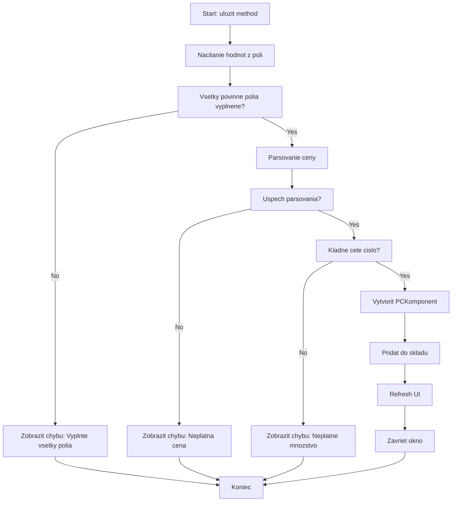

# PC Servis Manager

**Aplikácia na správu skladu PC komponentov a zostavovanie počítačových konfigurácií**

---

## Popis projektu

Tento program slúži na správu PC servisu, kde je možné pracovať s komponentmi PC (**CPU, RAM, SSD, GPU, MB, ZDROJ, CASE**).

Program umožňuje:
- Modelovanie skladu komponentov
- Manuálne vytváranie PC zostáv
- Automatické generovanie zostáv podľa zadaného rozpočtu
- Predaj zostáv 
- Analytiku – výpisy zostáv a inventára podľa kategórií

**Aktuálna verzia používa grafické užívateľské rozhranie (JavaFX)**.

---

## Technológie

- **Jazyk:** Java
- **GUI:** JavaFX + FXML
- **Štruktúra:** Objektovo-orientovaný prístup (triedy `Controller`, `AddComponentController`, `SkladProvider`, atď.)

---


## Hlavné funkcionality

- **Správa skladu** – prehľad komponentov v tabuľke a stromovom zobrazení, pridávanie nových komponentov
- **Manuálne vytvorenie PC zostavy** – výber komponentov podľa kategórií
- **Automatické vytvorenie zostavy** – generovanie optimálnej konfigurácie podľa zadaného maximálneho rozpočtu
- **Výpis zostavy** – detailný prehľad vybranej konfigurácie a celkovej ceny
- **Výpis inventára** – zobrazenie komponentov podľa kategórií

---
## Inštalácia a spustenie


```bash
# Spustiť hlavnú aplikáciu
java sk.spse.pcservis.ui.UIMain
```

## Vývojový diagram metódy ulozit()

```mermaid
flowchart TD
    Start[Start: ulozit method] --> Load[Nacitanie hodnot z poli]
    Load --> CheckRequired[Vsetky povinne polia vyplnene?]
    
    CheckRequired -->|No| Error1[Zobrazit chybu: Vyplnte vsetky polia]
    Error1 --> End[Koniec]
    
    CheckRequired -->|Yes| ParsePrice[Parsovanie ceny]
    ParsePrice --> CheckPrice[Uspech parsovania?]
    
    CheckPrice -->|No| Error2[Zobrazit chybu: Neplatna cena]
    Error2 --> End
    
    CheckPrice -->|Yes| CheckCount[Kladne cele cislo?]
    
    CheckCount -->|No| Error3[Zobrazit chybu: Neplatne mnozstvo]
    Error3 --> End
    
    CheckCount -->|Yes| Create[Vytvorit PCKomponent]
    Create --> Add[Pridat do skladu]
    Add --> Refresh[Refresh UI]
    Refresh --> Close[Zavriet okno]
    Close --> End
```


